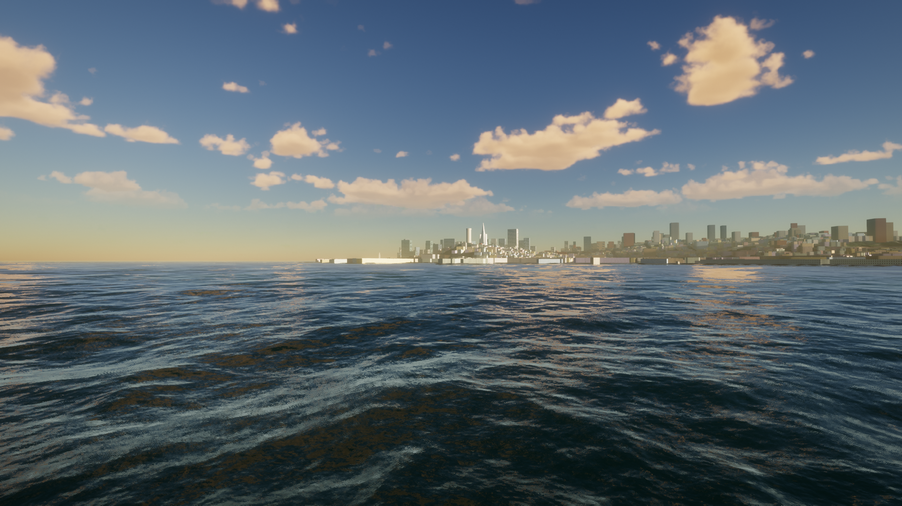
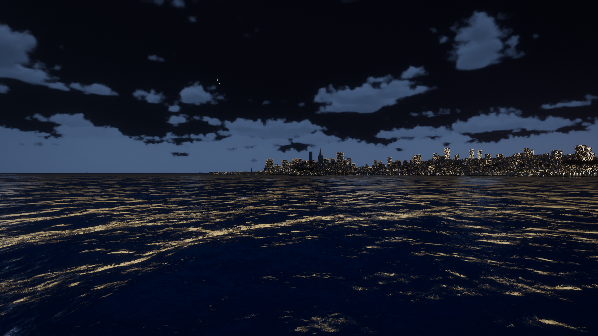
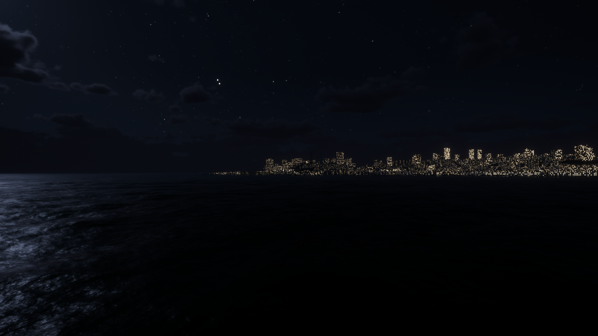

# SF Bay Crossing

San Francisco Bay in the browser, built from real data: walk the Embarcadero at the Ferry Building, take the
helm of a Golden Gate Ferry catamaran past Alcatraz to Sausalito, and watch the Golden Gate Bridge from golden
hour to the lit-up night skyline. It runs directly on WebGPU and WGSL, on the engine of
[Tidewater](https://github.com/dgreenheck/tidewater) (MIT), whose ocean, sky and post-processing it keeps.

**Play it:** https://icomppower.github.io/bay-crossing/



| Blue hour | Night |
|---|---|
|  |  |

## What's real

- **Terrain and seabed:** USGS 3DEP lidar elevation on land, NOAA NCEI topobathy below the water, merged on a
  3 m grid and set to local mean sea level (NOAA tide station 9414290).
- **Buildings:** 8,452 San Francisco footprints with the city's LiDAR-derived roof heights (DataSF) and 1,823
  Sausalito buildings from OpenStreetMap, extruded with procedural facades and three levels of detail.
- **Landmarks:** Golden Gate Bridge, Ferry Building, Coit Tower, Transamerica Pyramid and Alcatraz, built
  procedurally in Blender from OpenStreetMap positions and published dimensions. Checked against NOAA nautical
  charts to within 1–7 m.
- **Ferry:** the dimensions of MV *Golden Gate* (43.7 m catamaran, 1.5 m draft), on a route planned over the
  bathymetry from Ferry Building Gate C to the Sausalito landing. The autopilot crossing takes about 18 minutes;
  the published timetable allows 30.

Known gaps: the heights date from 2016 (no Salesforce Tower), the Embarcadero piers aren't walkable yet, and
the ferry is helm-only.

## Controls

| Key | Action |
|---|---|
| W A S D, mouse | Walk and look (click to capture the mouse) |
| E | Take the ferry helm / step ashore |
| W / S, A / D at the helm | Waterjets ahead / astern, steer |
| G | Ferry autopilot to Sausalito |
| T | Let the day run (golden hour → night) |
| F | Free camera |
| H, F1 | Settings, all controls |

**On a phone or tablet:** the left thumb joystick walks (or drives the ferry at the helm), dragging anywhere
else looks around, and on-screen buttons cover E, G, jump, camera, time and free camera. A lighter `mobile`
quality tier is picked automatically.

It needs a browser with WebGPU (a recent Chrome, Edge or Safari, including iOS 26 Safari and Android Chrome). On a Mac mini M4 it holds ~50 fps at
1080p on the `low` tier. The first load compiles the shaders and can take a minute.

## Run locally

```
npm install
npm run dev          # http://127.0.0.1:5189
```

## Data pipeline and checks

The shipped tiles in `public/` are built from cached downloads by deterministic scripts:

```
npm run fetch-data               # 9 sources into data/raw/ (gitignored), with a checksum manifest
node tools/terrain/build.mjs     # → public/terrain
node tools/buildings/build.mjs   # → public/buildings
node tools/landmarks/build.mjs   # → public/landmarks (needs Blender 5.x; BLENDER=/path/to/blender)
node tools/ferry/prepare.mjs && node tools/ferry/route.mjs   # → public/ferry
./verify.sh                      # gates G0–G6 (~20 min, headless WebGPU)
```

Each gate in `gates/` must first fail on a deliberately broken fixture, then pass for real. They cover data
checksums and licences, the clean fork, byte-identical pipelines, LOD and triangle caps, georeference against
NOAA charts, the ferry crossing (duration and draft clearance), and the M4 frame-time and GPU-memory budget.
Calibrated limits are frozen in `SPEC-THRESHOLDS.md`, and the reasoning is in `DECISIONS.md`.

## Credits and licences

Code: MIT (see `LICENSE`, Tidewater's). Data: DataSF building footprints (PDDL), OpenStreetMap (ODbL,
© OpenStreetMap contributors), USGS 3DEP and NOAA NCEI / CO-OPS / ENC (public domain). Golden Gate Ferry's GTFS
feed is used only for facts: terminal positions and trip times. Full details are in `CREDITS.md`.
